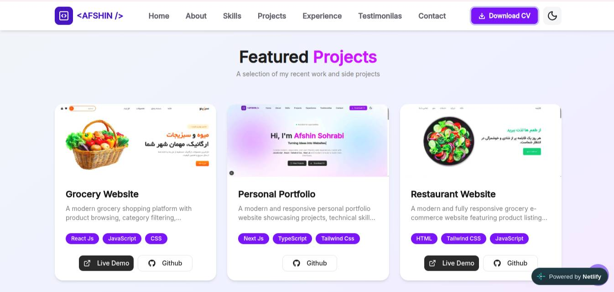
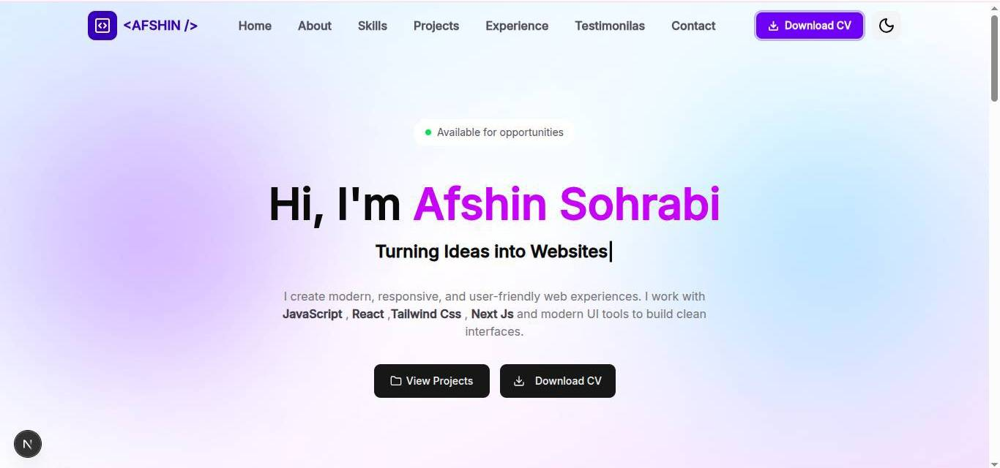

# 💼 Personal Portfolio

A modern and responsive personal portfolio built with **Next.js, React, TypeScript, and Tailwind CSS**.

The portfolio showcases my skills, experience, education, projects, achievements, and contact information through a clean and interactive user interface.

---

## 🔗 Live Demo

🌐 **Live Demo:** https://cool-cat-51bffb.netlify.app/

💻 **GitHub Repository:** https://github.com/imp-521/Portfolio

---

## 📸 Preview

### 🖥️ Desktop Preview



### 📱 Portfolio Preview



---

## 📖 About The Project

This project is my personal developer portfolio, created to present my professional background, technical skills, projects, experience, education, and ways to get in touch with me.

The main goal of the project was to build a modern and responsive portfolio while practicing **React, Next.js, TypeScript, Tailwind CSS, reusable components, animations, and modern frontend development techniques**.

The application is designed with a component-based structure, making it easier to maintain, customize, and extend.

---

## ✨ Features

* 👋 Modern Hero / Introduction section
* 👨‍💻 About Me section
* 🛠️ Skills & Technologies section
* 💼 Experience timeline
* 🎓 Education section
* 🚀 Projects showcase
* 📊 Personal statistics
* 💬 Testimonials section
* 📬 Contact section
* 🔗 Social media links
* 📱 Fully responsive design
* 🎨 Modern UI with Tailwind CSS
* ⚡ Smooth animations and interactions
* 🌓 Theme support
* 🧩 Reusable React components
* 📦 Centralized portfolio data
* 🔄 Dynamic content rendering
* 🚀 Production-ready Next.js application

---

## 🛠️ Technologies Used

* **Next.js**
* **React**
* **TypeScript**
* **Tailwind CSS**
* **Framer Motion**
* **AOS**
* **shadcn/ui**
* **Radix UI**
* **Lucide React**
* **React Icons**
* **React Multi Carousel**
* **React Type Animation**
* **next-themes**

---

## 🧠 What I Practiced

Through this project, I practiced:

* Building applications with **Next.js**
* Creating reusable **React components**
* Working with **TypeScript**
* Styling interfaces using **Tailwind CSS**
* Creating responsive layouts
* Building reusable UI components
* Managing portfolio content through a centralized data file
* Creating animations with **Framer Motion**
* Implementing scroll animations with **AOS**
* Working with theme management
* Creating responsive navigation
* Building interactive sections
* Structuring a scalable frontend project
* Improving UI/UX
* Preparing a project for production deployment

---

## 🧱 Project Structure

```text
Portfolio/
│
├── app/
│   ├── layout.tsx
│   ├── page.tsx
│   └── ...
│
├── components/
│   ├── UI Components
│   ├── Sections
│   └── Reusable Components
│
├── Constant/
│   └── Shared Constants
│
├── lib/
│   └── Utility Functions
│
├── public/
│   └── image/
│       ├── screen1.jpeg
│       └── screen2.jpg
│
├── data.ts
├── package.json
├── next.config.ts
├── tsconfig.json
├── eslint.config.mjs
├── postcss.config.mjs
└── README.md
```

---

## 🔄 How It Works

The portfolio uses a component-based architecture where the content is separated from the UI.

### 1️⃣ Portfolio Data

Personal information such as experience, statistics, testimonials, social links, and other content is managed through:

```text
data.ts
```

### 2️⃣ React Components

The data is consumed by reusable React components such as:

```text
Hero
About
Skills
Experience
Education
Projects
Testimonials
Contact
```

### 3️⃣ Next.js

Next.js handles the application structure, rendering, routing, and production build.

### 4️⃣ Responsive UI

Tailwind CSS is used to create a responsive interface that adapts to:

```text
Desktop
   ↓
Laptop
   ↓
Tablet
   ↓
Mobile
```

---

## 📱 Responsive Design

The portfolio is designed to provide a consistent experience across different screen sizes.

### 💻 Desktop

Optimized layouts with larger sections, navigation, project cards, and content areas.

### 📱 Mobile

The interface automatically adapts to smaller screens with responsive layouts and mobile-friendly navigation.

### 📲 Tablet

Intermediate layouts provide a comfortable experience between desktop and mobile.

---

## 🎯 Project Goal

The main goal of this project was to create a professional personal portfolio while improving my frontend development skills.

Instead of creating a simple static webpage, this project focuses on:

* Component-based development
* Reusable UI
* Responsive design
* Interactive animations
* Structured data
* Modern frontend technologies
* Production deployment

The project also serves as a central place to showcase my development experience and future projects.

---

## 🚀 Getting Started

### Clone the repository

```bash
git clone https://github.com/imp-521/Portfolio.git
```

### Navigate to the project

```bash
cd Portfolio
```

### Install dependencies

```bash
npm install
```

### Start the development server

```bash
npm run dev
```

Then open:

```text
http://localhost:3000
```

---

## 📦 Available Scripts

### Development

```bash
npm run dev
```

Starts the development server.

### Production Build

```bash
npm run build
```

Creates an optimized production build.

### Production Server

```bash
npm run start
```

Starts the production server.

### Lint

```bash
npm run lint
```

Checks the project for linting issues.

---

## 📊 Portfolio Statistics

Some portfolio information is managed through the centralized data structure.

| Metric                | Value |
| --------------------- | ----: |
| 💻 Years Experience   |     2 |
| 🚀 Projects Completed |    10 |
| 🤝 Happy Clients      |    30 |
| 🎓 Students Taught    |    50 |

---

## 🎨 Customization

Most of the portfolio content can be customized from:

```text
data.ts
```

You can update:

* 👤 Personal information
* 💼 Experience
* 🎓 Education
* 🚀 Projects
* 🛠️ Skills
* 📊 Statistics
* 💬 Testimonials
* 🔗 Social links
* 📬 Contact information

This makes it possible to update the portfolio content without changing the main UI components.

---

## 🌐 Deployment

The project is deployed using **Netlify**.

🔗 **Live Website:**

https://cool-cat-51bffb.netlify.app/

The project can also be deployed to other platforms that support Next.js applications.

---

## 🗺️ Roadmap

* [x] Responsive portfolio
* [x] Hero section
* [x] About section
* [x] Skills section
* [x] Experience section
* [x] Education section
* [x] Projects section
* [x] Statistics section
* [x] Testimonials
* [x] Contact section
* [x] Social links
* [x] Animations
* [x] Responsive navigation
* [x] Live deployment

### 🔮 Future Improvements

* [ ] Improve SEO
* [ ] Add Open Graph metadata
* [ ] Add project detail pages
* [ ] Add blog section
* [ ] Add MDX support
* [ ] Add contact form backend
* [ ] Add email notifications
* [ ] Add GitHub API integration
* [ ] Improve accessibility
* [ ] Optimize performance
* [ ] Add GitHub Actions / CI
* [ ] Add analytics

---

## 👨‍💻 Author

**Afshin Sohrabi**

Frontend Developer focused on building modern, responsive, and interactive web experiences.

### 🔗 Connect With Me

* 💻 GitHub: https://github.com/imp-521
* 💼 LinkedIn: http://www.linkedin.com/in/afshinsohrabi
* 📱 Telegram: https://t.me/imp_521

---

## ⭐ Support

If you like this project, feel free to:

⭐ Star the repository
🍴 Fork the project
🐛 Report issues
💡 Suggest improvements

---

<div align="center">

### Built with ❤️ and ☕

**Next.js · React · TypeScript · Tailwind CSS**

<br />

⭐ Thanks for checking out my portfolio!

</div>
